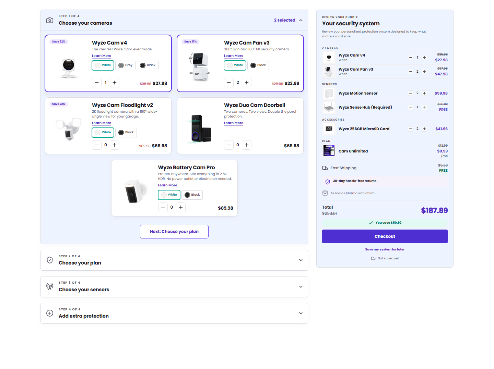

# Frontend Bundle Builder

[](https://github.com/JBM-05/Test/actions/workflows/ci.yml)

A responsive, four-step security-system bundle builder implemented from supplied Figma designs. The client-only React app provides a live order review, per-variant quantities, explicit save-for-later persistence, and accessible keyboard interactions.



## Highlights

- Configure cameras, a monitoring plan, sensors, and accessories through a guided accordion flow.
- Keep quantities independent for every product variant while updating prices and savings immediately.
- Enforce catalog rules, including the required Sense Hub when motion sensors are selected.
- Save and restore a validated, versioned bundle snapshot from local storage.
- Use the complete flow with a keyboard, reduced motion, responsive layouts, and accessible dialogs.
- Verify behavior with Vitest and Playwright and visual fidelity against immutable Figma exports.

## Quick start

### Prerequisites

- [Node.js](https://nodejs.org/) 22 (the exact project version is in `.nvmrc`)
- npm, included with Node.js

```bash
git clone https://github.com/JBM-05/Test.git
cd Test
nvm use
npm ci
npm run dev
```

Vite prints the local development URL after startup. To exercise the production output locally:

```bash
npm run build
npm run preview
```

The normal development and behavior-test flows use the bundled Poppins fallback. Exact visual comparisons additionally require the licensed Gilroy and TT Norms Pro files described in [`public/assets/fonts/README.md`](public/assets/fonts/README.md).

## Commands

| Command | Purpose |
| --- | --- |
| `npm run dev` | Start the Vite development server with HMR. |
| `npm run build` | Type-check and create the production build. |
| `npm run lint` | Run ESLint. |
| `npm run typecheck` | Run TypeScript without emitting files. |
| `npm run assets:verify` | Verify every catalog and component design asset exists and is non-empty. |
| `npm run fonts:verify` | Verify the six licensed Figma webfonts are present and valid WOFF2 files. |
| `npm run references:verify` | Verify the dimensions and SHA-256 hashes of the immutable Figma exports. |
| `npm run test:run` | Run the Vitest unit and integration suite once. |
| `npm run test:coverage` | Run Vitest and produce a coverage report. |
| `npm run e2e:behavior` | Run interaction, responsive-layout, dialog, persistence, and accessibility checks. |
| `npm run e2e:visual` | Compare the built app with the immutable desktop and mobile Figma exports. |
| `npm run visual:verify` | Verify licensed fonts and assets, build, then enforce a zero-pixel Figma diff. |
| `npm run check` | Run the complete non-visual CI verification sequence. |

Install Playwright's Chromium binary before the first local browser run:

```bash
npx playwright install chromium
npm run e2e:behavior
```

## Project structure

```text
src/
  features/bundle-builder/
    components/       Presentational React components
    data/             Versioned bundle catalog and seed configuration
    domain/           State transitions, invariants, types, and selectors
    formatting/       Display-only currency formatting
    hooks/            UI orchestration and reducer integration
    persistence/      Snapshot validation and local-storage adapter
    view-models.ts    Domain-to-presentation mapping
e2e/
  figma-reference/    Immutable design exports and their manifest
scripts/              Asset, font, and reference verification
```

## Product and architecture decisions

- **One source of truth.** A pure reducer owns only the open accordion step, active variant per product, and quantity per SKU. Review lines, selected counts, and monetary totals are selectors derived from that state.
- **Data-driven UI.** Ordered steps, products, variants, integer-cent prices, display metadata, and the seeded configuration live in the local bundle catalog. Components render the catalog rather than defining product-specific markup.
- **Variant-safe quantities.** Each variant has a stable SKU and independent quantity. Changing the active color changes which quantity the product-card stepper edits without discarding the other variants.
- **Domain invariants at the state boundary.** Counts cannot become negative, the plan is binary, and selecting a motion sensor adds the required Sense Hub. Removing all motion sensors removes that hub.
- **Client-only by design.** There is no router, commerce backend, or payment integration. Checkout opens a confirmation dialog so the prototype remains focused on configuration behavior.
- **Local assets and predictable rendering.** Product, selector, control, review, delivery, and guarantee assets are checked-in Figma exports at their rendered target sizes. The app avoids runtime third-party image requests, and an asset preflight prevents broken catalog or component references from reaching CI.

Feature code is grouped under `src/features/bundle-builder/`, with catalog/domain code kept separate from persistence, presentation components, and animation hooks. This keeps pricing and selection rules testable without rendering React and keeps framework details out of the core state transitions.

## Save-for-later behavior

Persistence is intentionally explicit. Editing the bundle does **not** write automatically; activating **Save my system for later** stores a versioned snapshot in `localStorage` under `wyze-bundle-builder:v1`. The snapshot includes quantities, active variants, and the accordion state.

Hydration accepts only the current schema/catalog versions and known product, variant, and step identifiers. Invalid, stale, malformed, or inaccessible storage falls back to the Figma seed. This makes schema changes safe and prevents corrupted browser data from breaking the builder.

## Accessibility and motion

- Accordion headers are native buttons following the WAI-ARIA accordion pattern, with labelled regions and programmatic focus when advancing.
- Variant choices are radio groups; quantity controls have contextual accessible names and disabled states; status changes are announced through a polite live region.
- Learn More and Checkout use modal-dialog semantics, support Escape, trap focus while open, and restore focus to the trigger on close.
- Interactive targets remain usable at phone widths, focus indicators are visible, and radio/pressed/expanded states are exposed programmatically.
- GSAP is limited to presentational accordion, card, review-line, total, and dialog transitions. React state and ARIA remain authoritative. `prefers-reduced-motion` resolves animations directly to their final state.

The supplied Figma palette contains documented contrast exceptions for review category labels, savings copy, and the struck-through comparison total. The axe suite continues to enforce WCAG A/AA rules everywhere else; it does not represent those exact design tokens as AA-compliant.

The automated suite currently includes 27 Vitest unit/integration tests for catalog validation, reducer, selector, persistence, formatting, and React interaction behavior, plus 30 Playwright behavior/accessibility checks across desktop, wide-tablet, tablet, mobile, and narrow-mobile viewports. A separate deterministic visual suite compares the production build with immutable Figma exports at 1440x1077 and 390x1252 and requires zero non-antialiasing pixel differences.

Gilroy and TT Norms Pro are commercial fonts and are not redistributed by this repository. Standard CI therefore runs the complete non-visual verification sequence. In a licensed local environment, add the WOFF2 copies using the filenames documented in `public/assets/fonts/README.md`, then run `npm run visual:verify`; the command fails fast when the licensed fonts are absent so an approximate fallback cannot be accepted by the exact visual gate.

Coverage gates are enforced at 80% for statements, functions, and lines and 75% for branches. The latest verified run reports 85.52% statement coverage and 88.48% line coverage. A production Lighthouse audit scored 90 for Performance and 100 for Accessibility, Best Practices, and SEO; these scores describe that audited environment and are not treated as permanent guarantees.

## Design references

- [Desktop reference - Figma node 68:9663](https://www.figma.com/design/JYf61etQVqeseX7oY5alGz/Frontend-Test-Figma?node-id=68-9663)
- [Mobile reference - Figma node 74:19845](https://www.figma.com/design/JYf61etQVqeseX7oY5alGz/Frontend-Test-Figma?node-id=74-19845)
- [Tablet reference - Figma node 70:14135](https://www.figma.com/design/JYf61etQVqeseX7oY5alGz/Frontend-Test-Figma?node-id=70-14135)

The desktop and mobile nodes are the page-level pixel-fidelity targets. The tablet node defines the five-card composition used from 1024px through 1279px and remains a component/layout reference rather than a second 1440px screenshot expectation. Exact exports, structured layer measurements, design tokens, target-size raster assets, and intrinsic SVG controls from the supplied Figma file drive the implementation. See `e2e/figma-reference/README.md` for the immutable-reference contract.
